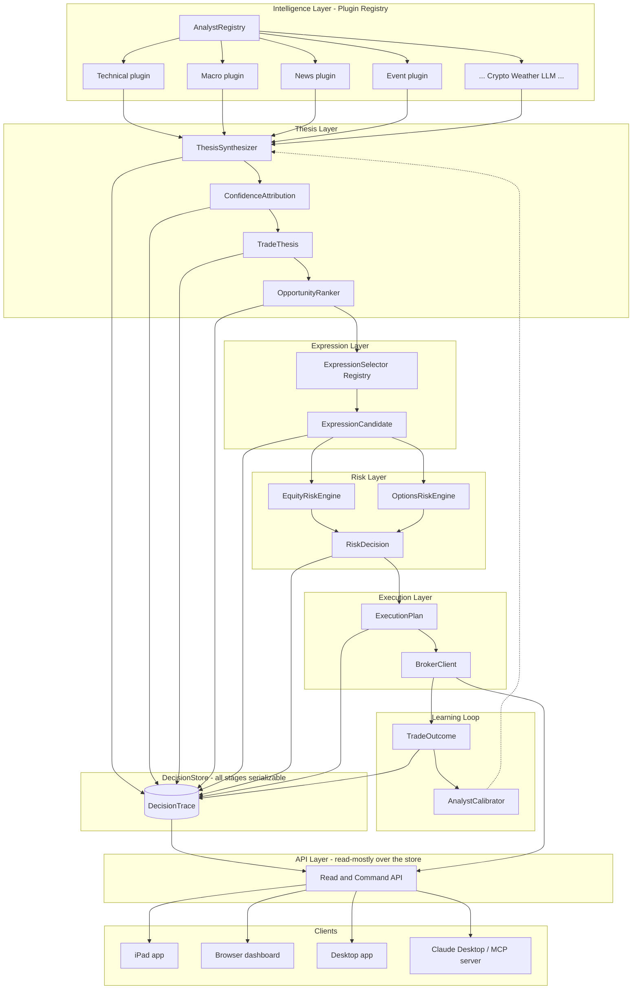
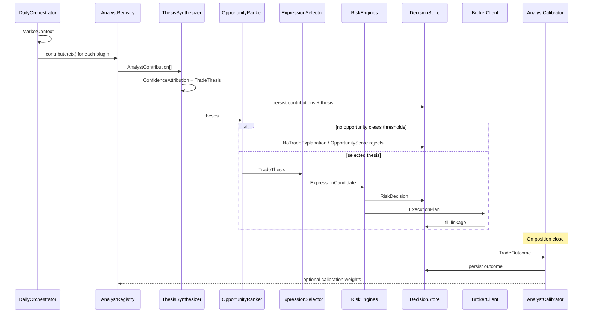
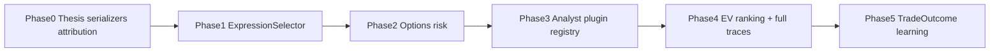

# Trading Engine Evolution — Architecture Design (v2)

## North star

> Build a modular market intelligence platform that continuously searches for the highest expected-value opportunities across asset classes, expresses those opportunities through the most appropriate financial instrument, learns from every completed trade, and remains fully explainable at every stage of the decision process.

Every design choice is judged against that sentence: EV search over forced trades; explainability over opaque votes; plugins over hardcoded modules; learning from outcomes over a static rules engine.

**Status:** Phase 0 implemented (see Implementation status, below). Phases 1–5 remain design-only pending approval.

---

## Baseline (constraints)

| Capability | Current state |
|------------|---------------|
| Equity daily pipeline | Working (`run_daily_bot` → `daily_runner` → `run_trading_cycle`) |
| Signals | Ensemble → Buy/Sell/Hold via [`Signal`](logic/data_structures.py) |
| Execution | Market + bracket via [`BrokerClient`](logic/broker_client.py) |
| Stock risk | [`PortfolioRiskConfig`](logic/risk_config.py) + `enforce_risk_limits` |
| Options | Thin ATM/DTE prototype; not in daily bot |
| News / macro / learning | Absent |
| TradeThesis | Exists (Phase 0) — built and shadow-logged, not yet consumed |
| DecisionTrace | Does not exist |
| API / client surface | Absent — no way in except the daily runner |

Progress toward north-star architecture: **~20–30%**.

---

## Philosophy (decision order)

1. What is happening? (plugin analysts → contributions)
2. What is the highest-EV opportunity? (ranking)
3. What is our market view? (`TradeThesis` — direction + horizon, not instrument)
4. How do we express that view? (`ExpressionSelector`)
5. Is the EV worth the risk? (equity vs options risk engines)
6. Execute (broker) — last
7. After close: record `TradeOutcome` and feed learning

---

## 1. Architecture diagram



**Key separation:** analysts and LLMs never place trades. They only emit `AnalystContribution`. Expression and risk are downstream plugins.

---

## 2. Serializable decision pipeline (mandatory)

Every stage produces a **first-class, serializable object**. All are persisted under a single `DecisionTrace` (or equivalent store) keyed by `decision_id` / trade day / symbol.

```text
MarketContext
  → AnalystContribution[]
  → TradeThesis          (+ ConfidenceAttribution)
  → OpportunityScore
  → ExpressionCandidate
  → RiskDecision
  → ExecutionPlan
  → TradeOutcome         (after position close)
```

**Why:** six months later, reconstruct “Why did we buy TSLA on July 14?” as a full decision tree for debugging and research.

Requirements:

- JSON-serializable dataclasses (or equivalent) at every stage
- Stable schema version field on traces
- Link `ExecutionPlan` → open position → `TradeOutcome` on close
- Extend / supersede today’s [`DecisionLogEntry`](logic/data_structures.py); do not lose existing audit fields during migration

`TradeExplanation` / `NoTradeExplanation` are views over the same stored objects, not a parallel ad-hoc log format.

---

## 3. New classes and interfaces

### 3.1 Context objects (not flat strings)

Do **not** conflate market regime, macro, structural themes, and catalysts.

| Type | Role | Examples |
|------|------|----------|
| `MarketDirection` | Directional price view | `BULL`, `BEAR`, `SIDEWAYS`, `UNKNOWN` |
| `MacroRegime` | Macro policy/cycle | `INFLATION_RISING`, `RATE_CUTS`, `TIGHTENING` |
| `StructuralTheme` | Multi-month/year narrative | `AI_BOOM`, `NUCLEAR_ENERGY`, `SEMICONDUCTOR_EXPANSION`, `DEFENSE_SPENDING` |
| `Catalyst` | Discrete near-term trigger | `EARNINGS`, `CPI`, `WAR`, `HURRICANE`, `FOMC` |

These are typed values (enums or small dataclasses with `code` + optional `detail`), attached to `MarketContext` and/or `TradeThesis` — never jammed into one `macro_regime` string that also means “war.”

**Naming — direction vs. state.** This type was originally specified as `MarketRegime`, which collided with a pre-existing [`MarketRegime`](logic/game_utils.py) in `game_utils` — a probability mixture over market *character* (`prob_trend` / `prob_range` / `prob_high_vol`) that carries no direction at all. Two live classes with one name is a footgun, so they were split during Phase 0:

| Class | Module | Answers |
|-------|--------|---------|
| `MarketState` | [`logic/game_utils.py`](logic/game_utils.py) | Is the market trending, ranging, or volatile? |
| `MarketDirection` | [`logic/thesis/context.py`](logic/thesis/context.py) | Which way is it going? |

`MarketDirection.from_market_state()` bridges the two and **refuses to invent a direction** the state mixture does not contain: a trend-dominant state with no directional hint yields `UNKNOWN`, not a guessed `BULL`. The producing function is now `compute_market_state()`.

One deliberate exception: the `Signal.meta["market_regime"]` **dict key** keeps its old name. It is persisted in decision history, so renaming it would invalidate stored decisions.

### 3.2 TradeThesis

```python
@dataclass
class ConfidenceAttribution:
    """Per-analyst deltas that sum toward final confidence (explainable).

    Both finals are stored so the breakdown always reconciles. Clipping alone
    would break the audit trail: base 0.50 + deltas summing +0.65 yields a
    clipped final of 1.00 that no longer matches its own deltas, and the 0.15
    of overshoot vanishes. `overflow` keeps that visible -- it is itself a
    signal when calibrating analysts.
    """
    by_analyst: dict[str, float]   # e.g. {"technical": +0.22, "macro": +0.08, "news": -0.04}
    base: float                    # prior / baseline before analysts (0.5 = no view)
    raw_final: float               # == base + sum(deltas); exact, always reconciles
    final: float                   # == clip(raw_final, 0, 1); what downstream consumes
    # overflow = raw_final - final (derived property)

@dataclass
class TradeThesis:
    symbol: str
    direction: Literal["LONG", "SHORT", "FLAT"]
    confidence: float                      # == attribution.final
    confidence_attribution: ConfidenceAttribution
    expected_return: float
    expected_holding_period: int           # days (numeric duration)
    time_horizon: Literal[                 # semantic bucket — distinct from period days
        "INTRADAY", "SWING", "POSITION", "LONG_TERM"
    ]
    conviction: Literal["LOW", "MEDIUM", "HIGH"]
    volatility_expectation: Literal["LOW", "MEDIUM", "HIGH"]
    market_direction: Optional[MarketDirection] = None
    macro_regime: Optional[MacroRegime] = None
    structural_themes: list[StructuralTheme] = field(default_factory=list)
    catalysts: list[Catalyst] = field(default_factory=list)
    supporting_evidence: list[str] = field(default_factory=list)
    reasoning_log: list[str] = field(default_factory=list)
    analyst_ids: list[str] = field(default_factory=list)
    source_signal_id: Optional[str] = None
    schema_version: str = "1"
    meta: dict = field(default_factory=dict)
```

**Why both `expected_holding_period` and `time_horizon`:**  
“AI infrastructure bullish for six months” (`LONG_TERM` / `POSITION`) vs “CPI tomorrow” (`INTRADAY` / `SWING`) are different kinds of ideas; expression and risk policy will eventually key off horizon.

**No instrument fields** on the thesis.

### 3.3 Analyst plugins (not hardcoded modules)

Orchestration never imports a fixed list of analyst classes. It only talks to a registry:

```python
class MarketAnalyst(Protocol):
    analyst_id: str
    def contribute(self, ctx: MarketContext) -> list[AnalystContribution]: ...

class AnalystRegistry:
    def register(self, analyst: MarketAnalyst) -> None: ...
    def all(self) -> Sequence[MarketAnalyst]: ...
```

Discovery: explicit registration at startup (config / entry points / `register_default_analysts()`). Dropping in `CryptoAnalyst` or `WeatherAnalyst` requires **no orchestrator edits** — only registration.

`AnalystContribution` must include:

- `analyst_id`
- `confidence_delta` (feeds `ConfidenceAttribution`)
- evidence snippets / tags
- optional regime/theme/catalyst suggestions
- optional horizon hints

**Example plugins (not an exhaustive hardcoded set):** Technical (wrap current ensemble first), Macro, News, Event, Sector, Portfolio, and later Crypto / Weather / **LLMAnalyst**.

### 3.4 Future LLM analyst (clean integration point)

```text
LLMAnalyst (plugin)
  → reads earnings, SEC filings, Reuters, Fed speeches, etc.
  → produces AnalystContribution (+ confidence_delta, evidence)
  → NEVER places trades
```

Same Protocol as every other analyst. No special-case path in the runner.

### 3.5 ExpressionSelector (renamed from InstrumentSelector)

Thesis → **expression** → strategy (which may share an instrument under different strategies).

```python
class ExpressionStrategy(Protocol):
    strategy_id: str
    def is_applicable(self, thesis: TradeThesis, ctx: MarketContext) -> bool: ...
    def propose(self, thesis: TradeThesis, ctx: MarketContext) -> list[ExpressionCandidate]: ...

class ExpressionSelector:
    def __init__(self, strategies: Sequence[ExpressionStrategy]): ...
    def select(self, thesis: TradeThesis, ctx: MarketContext) -> list[ExpressionCandidate]: ...
```

**Phase 1 strategies:** `long_stock`, `short_stock`, `long_call`, `long_put`.

**Later (register only):** bull/bear verticals, covered call, CSP, iron condor, calendar, butterfly — no runner changes.

Reuse [`options_engine.py`](logic/options_engine.py) inside call/put proposers.

### 3.6 Risk engines

| Engine | Notes |
|--------|-------|
| `EquityRiskEngine` | Facade over existing equity limits — preserve behavior |
| `OptionsRiskEngine` | Dedicated config; incremental constraints |

Shared output: serializable `RiskDecision(accept | resize | reject, reasons, resized_candidate?)`.

Options config (architecture now; some fields stubbed): premium, contracts, OI, volume, bid/ask, DTE, delta, gamma/theta/IV hooks.

### 3.7 Learning — TradeOutcome (critical)

After every **closed** trade:

```python
@dataclass
class TradeOutcome:
    decision_id: str
    symbol: str
    strategy_id: str
    expected_return: float
    actual_return: float
    expected_holding_period: int
    actual_holding_period: int
    time_horizon: str
    confidence: float
    confidence_attribution: ConfidenceAttribution
    analyst_ids: list[str]
    market_direction: Optional[MarketDirection]
    macro_regime: Optional[MacroRegime]
    structural_themes: list[StructuralTheme]
    catalysts: list[Catalyst]
    win: bool
    outcome_reason: str          # structured why won/lost
    schema_version: str = "1"
```

**AnalystCalibrator** (Phase 5): aggregate outcomes → bias estimates (“News overestimates biotech”; “momentum works better in low vol”) → optional weight / prior adjustments on future contributions. Learning adjusts **intelligence**, never bypasses risk or expression.

Without this loop the platform stays static.

### 3.8 Core domain summary

| Object | Role |
|--------|------|
| `MarketContext` | Universe, portfolio, calendar, regimes/themes/catalysts snapshot |
| `AnalystContribution` | Plugin output + confidence_delta |
| `ConfidenceAttribution` | Explainable confidence breakdown |
| `TradeThesis` | Directional view + horizons + context objects |
| `OpportunityScore` | EV / risk-adjusted EV ranking record |
| `ExpressionCandidate` | Proposed expression (strategy_id, legs, costs, rationale) |
| `RiskDecision` | Accept / resize / reject + reasons |
| `ExecutionPlan` | Broker-ready (wraps/extends `OrderPlan`) |
| `TradeOutcome` | Post-close learning record |
| `DecisionTrace` | Bundle + persist all of the above for one decision |
| `Signal` | **Keep** for backward compatibility |

---

## 4. Data flow (market day + close)



Compatibility (Phase 0): `Signal` → `signal_to_thesis()` → existing equity plan/risk when flags default — production behavior unchanged.

---

## 5. Migration strategy



| Phase | Goal | Equity production |
|-------|------|-------------------|
| **0** | Thesis + context types + attribution + serialize/shadow-log | Identical |
| **1** | `ExpressionSelector`; stock strategies = current guts; options propose/log only | Default unchanged |
| **2** | Options risk + optional expression flag; `BrokerClient` options | Equity default |
| **3** | `AnalystRegistry`; Technical plugin live; other plugins stub; LLM slot documented | Unchanged until stubs filled |
| **4** | EV ranker; mandatory no-trade traces; full `DecisionTrace` | Gated EV search |
| **5** | `TradeOutcome` on close; calibrator hooks; research queries over store | Learning off by default until validated |

**Hard rule:** equity regression tests at default flags every phase.

---

## 6. Compatibility plan

| Existing | Fate |
|----------|------|
| `Signal` | Keep; adapters to/from thesis |
| `OrderPlan` | Keep; nest under `ExecutionPlan` |
| `decide_action` / `build_order_plan` | Guts of long/short stock expression |
| `BrokerClient` | Extend, don’t replace |
| `enforce_risk_limits` | EquityRiskEngine core |
| Options side path | Fold into expression + options risk |
| Ensemble | Technical plugin provider |
| `DecisionLogEntry` | Migrate into `DecisionTrace` fields; retain queryability |

---

## 7. Repository impact

| Area | Impact |
|------|--------|
| [`logic/data_structures.py`](logic/data_structures.py) | Thesis, attribution, context types, outcome; keep Signal/OrderPlan |
| New packages as needed | `logic/analysts/` (registry + plugins), `logic/expression/`, `logic/thesis/`, `logic/learning/`, `logic/decision_store/` |
| [`logic/execution_engine.py`](logic/execution_engine.py) | Thin orchestration over plugins |
| [`logic/options_engine.py`](logic/options_engine.py) | Used by expression strategies |
| [`logic/risk_config.py`](logic/risk_config.py) | `OptionsRiskConfig` |
| [`logic/daily_runner.py`](logic/daily_runner.py) | Registry-driven loop; persist traces |
| Decision storage | SQLite/extension of existing decision DB — all pipeline objects |
| `api/` (new) | First-class API layer over the store — see §10 |
| Exercises / notebooks | Untouched |

---

## 8. Risks

| Risk | Mitigation |
|------|------------|
| Equity regressions | Default legacy path + golden tests |
| Hardcoded analyst lists creep back | Only `AnalystRegistry` in orchestrator |
| Opaque confidence | Require `ConfidenceAttribution` on every thesis |
| Unreconstructable decisions | Mandate serializable stage objects + `DecisionTrace` |
| No learning forever | Phase 5 is first-class; outcome on every close |
| LLM trading by accident | LLM is analyst plugin only |
| Cargo-cult empty fields | Horizon/regime/theme/catalyst typed; empty lists OK, wrong conflation not |
| Expression vs instrument confusion | Name is `ExpressionSelector`; strategies registered by `strategy_id` |

---

## 9. Phase-by-phase implementation (post-approval only)

### Phase 0 — Foundation
- Context types, `TradeThesis`, `ConfidenceAttribution`, serializers
- Adapters from `Signal`; shadow persist alongside current logs

### Phase 1 — Expression
- `ExpressionStrategy` + `ExpressionSelector`
- Long/short stock via existing sizing/brackets
- Long call/put proposers (log / dry-run)

### Phase 2 — Options risk
- `OptionsRiskEngine` + persist `RiskDecision`
- Optional options expression; extend `BrokerClient`

### Phase 3 — Plugin intelligence
- `AnalystRegistry`; Technical wraps ensemble
- Stub plugins; document `LLMAnalyst` contract
- Attribution populated from contribution deltas

### Phase 4 — EV daily operation
- `OpportunityRanker`; min EV thresholds
- Always persist trade or no-trade trace

### Phase 5 — Learning
- `TradeOutcome` on close
- `AnalystCalibrator` (weights / diagnostics first; auto-apply gated)
- Research API: reconstruct decision tree by date/symbol

**Deferred:** multi-leg strategies, production news/FinBERT/feeds, IV surfaces, live LLM analyst, shorting in production, ETFs as asset class.

---

## 10. API layer (first-class component)

The engine currently has exactly one consumer: the daily runner. Every new surface — iPad, browser dashboard, desktop, Claude Desktop, a future MCP server — must not become a new reason to reach into `logic/`. The API is the seam:

```text
Backend  →  Trading Engine  →  API  →  Clients
```

Treating it as first-class (rather than "add a Flask route later") is what keeps client count from multiplying engine complexity. Four clients against one API is one integration; four clients against the engine is four.

### 10.1 Surface

| Method | Endpoint | Returns |
|--------|----------|---------|
| `GET` | `/portfolio` | Equity, cash, exposure, day P/L |
| `GET` | `/positions` | Open positions + attached exits |
| `GET` | `/trade-theses` | `TradeThesis` records (filter by date/symbol) |
| `GET` | `/market-context` | `MarketContext`: state, direction, themes, catalysts |
| `GET` | `/decision-log` | `DecisionTrace` / `DecisionLogEntry`, incl. no-trade explanations |
| `GET` | `/candles/{symbol}` | OHLCV for charting |
| `POST` | `/paper-trade` | Submit a paper order |
| `POST` | `/close-position` | Close an open position |

### 10.2 Design rules

1. **No trading logic in the API.** Handlers marshal to and from engine calls and serializers. Any rule that decides *whether* to trade lives in the engine. If a rule can only be enforced by the API, a non-API caller can bypass it.
2. **Read endpoints are views over the DecisionStore**, not recomputations. `/trade-theses` returns what was persisted at decision time — otherwise the "why did we buy TSLA on July 14" reconstruction is a lie.
3. **The engine never imports the API.** Dependency points one way. The engine must stay runnable headless with no server present.
4. **Serialization is already solved.** Every pipeline stage is a JSON-serializable dataclass with a `schema_version` (§2). The API reuses those serializers rather than defining response DTOs — one schema, not two that drift.
5. **MCP is a client, not a special case.** A future MCP server calls the same endpoints. It gets no privileged path into the engine.

### 10.3 Write-endpoint safety

`POST /paper-trade` and `POST /close-position` move real positions and deserve harder rules than the read surface:

- **Authentication required** on every write; reads may be local-only, writes never unauthenticated. This backend is one port-forward from being internet-reachable.
- **Execution mode is server-side state, never a request parameter.** A client must not be able to promote itself from paper to live by setting a field.
- **Writes route through the same risk engines as the daily runner.** An API order is not a bypass of `enforce_risk_limits`; if it skips risk, the API becomes the least-safe path into the account.
- **Every API-initiated order is persisted** with its `DecisionTrace` and marked as client-initiated, so the learning loop can tell manual overrides from engine decisions — otherwise Phase 5 calibrates on trades the analysts never proposed.
- **Idempotency keys on writes.** Mobile clients retry on flaky connections; a retried "close position" must not double-submit.

### 10.4 Sequencing

The API is **independent of Phases 1–5** and can proceed in parallel: it is read-mostly over the DecisionStore, and the read surface needs only what already exists (portfolio, positions, decisions, candles) plus Phase 0's theses. The one hard dependency is that `/trade-theses` and `/decision-log` are only as good as the store beneath them, so it should follow the DecisionTrace storage decision (Gap #5) rather than lead it.

Suggested order: read endpoints first (zero write risk, immediately useful for an iPad dashboard), write endpoints only once auth and the risk-routing rule above are in place.

---

## Design commitments (locked)

1. Evolve the equity pipeline — do not rewrite it.
2. `TradeThesis` is the only intelligence → expression handoff (no instrument on thesis).
3. `time_horizon` and `expected_holding_period` are both first-class.
4. `MarketDirection`, `MacroRegime`, `StructuralTheme`, `Catalyst` are separate types.
5. Analysts are **plugins** via `AnalystRegistry` (including future `LLMAnalyst`).
6. Confidence is **attributed** per analyst, not a naked float.
7. Selector is **`ExpressionSelector`**, not instrument-only naming.
8. **Every pipeline stage is serializable and stored** in a `DecisionTrace`.
9. **`TradeOutcome` + learning** after every closed trade.
10. Separate equity vs options risk engines.
11. North star includes learning; never force trades below EV/risk thresholds.
12. **Implementation starts only after architecture approval.**
13. **The API is a first-class layer**, not a bolt-on. Every client (iPad, browser, desktop, MCP) goes through it; the engine never imports it and stays runnable headless.
14. **Direction and state are separate types.** `MarketDirection` (which way) is not `MarketState` (trending / ranging / volatile), and neither may be inferred from the other without an explicit hint.

---

## Audit appendix

1. **Execution:** Partial abstraction; market + bracket on main path.
2. **Signals:** Buy/Sell/Hold; no thesis yet.
3. **News:** Absent.
4. **Options:** Side-path ATM/DTE; not in daily bot.
5. **Risk:** Stock only; no options-specific rules.
6. **Learning / attribution / decision store:** Absent — addressed in this v2 design.

---

## Pre-Opus Review Notes (address before/during implementation)

The structure, naming, and separation of concerns above are solid. What the doc underspecifies is the two mechanisms that make the north star actually work — EV scoring and learning feedback — plus how any of it gets validated.

**Open gaps:**

1. **No concrete EV formula.** Phase 4's `OpportunityRanker` is named but nothing defines how `expected_return × confidence × horizon × risk` becomes a comparable score across symbols/instruments, or how horizons normalize (2% in 3 days vs. 8% in 6 months aren't directly comparable). This is the actual hard part of "highest expected-value opportunity" and needs at least a sketch before Phase 4 starts. **Blocks Phase 4.**
2. **`AnalystCalibrator` (Phase 5) is the least specified phase** despite being called critical. No mechanism for how calibration weights feed back into `confidence_delta`, and no guardrail against overfitting to a small trade sample — the live account is small (see funding-threshold notes), so live trade counts will stay low for months. Learning should run against backtest/paper data before it is trusted on real capital. **Blocks Phase 5.**
3. **Backtesting is absent from the architecture, though not from the repo.** An EV-search-plus-learning-loop system cannot be validated on 1–2 live trades a week. [`PredictionBacktester`](logic/prediction_backtester.py) already exists and should be wired in as the validation surface for Phases 4–5 — the task is integration, not a new harness.
4. **`DecisionTrace` storage mechanics are vague** ("SQLite/extension of existing decision DB"). Confirm the schema migration path (new tables vs. widening `DecisionLogEntry`) — every later phase depends on this store being right the first time. Phase 0 deliberately shadow-logs theses to JSONL rather than SQLite to avoid pre-empting this decision.

**Resolved during Phase 0:**

- ~~`ConfidenceAttribution` arithmetic is unspecified.~~ Resolved: `raw_final` and `final` are both stored, `base + sum(deltas) == raw_final` is enforced at construction (raises on mismatch), `final = clip(raw_final, 0, 1)`, and `overflow` exposes what clipping removed. See §3.2.
- ~~Two classes named `MarketRegime`.~~ Resolved: split into `MarketState` and `MarketDirection`. See §3.1.

**Smaller nits:**

- Naming inconsistency: the domain summary table (3.8) calls it `OpportunityScore`; the sequence diagram implies it via `Rank` without showing it persisted. Align naming before codegen.
- No per-phase acceptance criteria. Add a one-line "done when" test per phase so there's a testable definition of done, not just a feature list. (Phase 0's, for reference: theses round-trip through JSON, attribution reconciles, adapter preserves signal confidence exactly, existing equity tests still pass.)

---

## Implementation status

| Phase | Status | Notes |
|-------|--------|-------|
| **0** | **Done** | `logic/thesis/` — context types, `ConfidenceAttribution`, `TradeThesis`, `Signal` adapter, JSONL shadow logging wired into `daily_runner`. 30 tests in `test_thesis_phase0.py`; 40 pass with the existing suite. Equity path unchanged — nothing consumes a thesis yet. |
| 1–3 | Not started | Implementable as specified |
| 4 | Blocked | Needs the EV formula (gap #1) |
| 5 | Blocked | Needs calibration math (gap #2) + backtester integration (gap #3) |
| API (§10) | Not started | Independent of 1–5; follows the storage decision (gap #4) |

---

## Approval gate

This v2 incorporates the pre-coding refinements (horizon, context split, plugins, learning, attribution, ExpressionSelector, serializable stages, LLM analyst slot, stronger north star), plus the API layer (§10) and the direction/state split (§3.1).

Phases 1–3 are implementable as written. Phases 4–5 should not start until gaps #1 and #2 are decided — those formulas determine what `OpportunityScore` and the calibration hooks need to carry, and guessing at them means guessing at the math that picks real trades.
